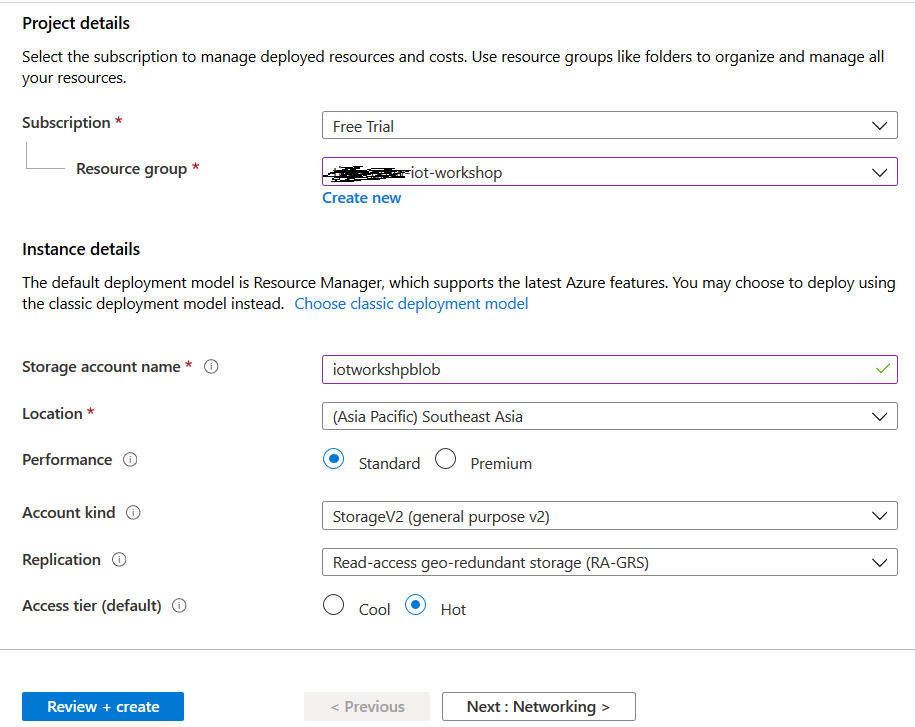
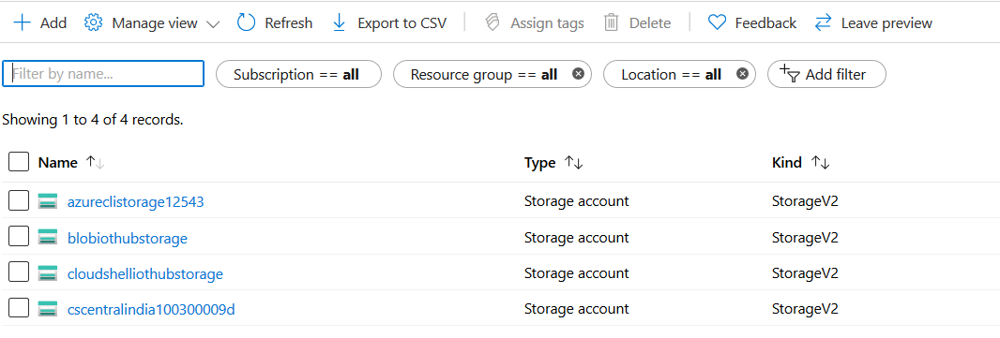

Real Time Monitoring of IOT data

    

Before the hands-on lab setup guide

Mar 2020

**Contents**

<!-- TOC -->

- [Real Time Monitoring of IOT data before the hands-on lab setup guide](#iot-data-and-monitoring-before-the-hands-on-lab-setup-guide)
  - [Requirements](#requirements)
  - [Before the hands-on lab](#before-the-hands-on-lab)
    - [Task 1: Provision Azure IOT Hub](#task-1-provision-azure-databricks)
    - [Task 2: Create Azure Storage account](#task-2-create-azure-storage-account)
    - [Task 3: Create storage container](#task-3-create-storage-container)
    - [Task 4: Provision Azure Stream Analytics](#task-4-provision-azure-data-factory)
    - [Task 5: Setup Power BI Account](#task-5-download-and-install-power-bi-desktop)
    - [Task 6: Download Azure Storage Explorer](#task-6-download-and-install-azure-storage-explorer)

<!-- /TOC -->

# Real Time Monitoring of IOT data before the hands-on lab setup guide

## Requirements

1.  Microsoft Azure subscription must be pay-as-you-go or MSDN.

    a. Trial subscriptions will not work.

## Before the hands-on lab

Duration: 30 minutes

In this exercise, you will set up your environment for use in the rest of the hands-on lab. You should follow all the steps provided in the Before the Hands-on Lab section to prepare your environment _before_ attending the hands-on lab.

### Task 1: Provision Azure IOT Hub

Azure IOT Hub is an Azure service that enables you to ingest high volumes of data from your IoT devices into the cloud for storage or processing.

> **Note**: To view the Azure portal menu, select the menu icon in the upper left-hand corner.

1. In the [Azure Portal](https://portal.azure.com) (https://portal.azure.com), select **+ Create a resource** within the portal menu, then type "IOT Hub" into the search bar. Select IOT Hub from the results.

   

2. From IOT Hub, click on +Add.

3. Enter the details as below:
    a.	Resource Group: Create new and give name as iotworkshop-rg
    b.	Other details as below

   

4. Click on Review + Create.

### Task 2: Create Azure Storage account

Create a new Azure Storage account that will be used to store IOT Hub data and Reference data (mapping)

1. In the [Azure Portal](https://portal.azure.com) (<https://portal.azure.com>), select **+ Create a resource**, then type "storage" into the search bar. Select **Storage account** from the results.

   

2. From Storage Accounts page, Click on +Add. 

3. Select the same Resource Group as above.

4. Enter the details as below:

    

5. Click on Review + Create.

### Task 3: Create storage container

In this task, you will create a storage container in which you will store the data.

1. Type Storage Account in Search box.

2. Click on the storage account created.

   

3. Scroll down on the Left Pane and select Containers and on the right side Click on +Container and enter the Container name.

   

### Task 4: Provision Azure Stream Analytics

Create a Azure Stream Analytics which is a real-time analytics and complex event-processing engine that is designed to analyze and process high volumes of fast streaming data from multiple sources simultaneously.

1. In the [Azure Portal](https://portal.azure.com) (<https://portal.azure.com>), 1.	Type Stream Analytics in Search box and select Stream Analytics jobs.

   

2. From Stream Analytics Page, select +Add.

3. Enter the below details, select the Resource Group as that was created above. Click Create:

   

4. Select **Create** to finish and submit.

### Task 5: Create Power BI Account

In this task we will create Power BI Online account as it supports real time monitoring using Streaming data.

1. Go to https://app.powerbi.com.
2. Click on Sign In and Create an Account using Work Account

    
    
Power BI desktop is required to make a connection to your Blob Storage for batch reporting.

1. Download and install Power BI Desktop. (https://powerbi.microsoft.com/en-us/desktop/)

### Task 6: Download Azure Storage Explorer

Azure Storage Explorer is required to upload/ view data in Data Lake Gen 2.

1. Download and install [Storage Explorer] (https://azure.microsoft.com/en-us/features/storage-explorer/).

You should follow all these steps provided _before_ attending the Hands-on lab.
