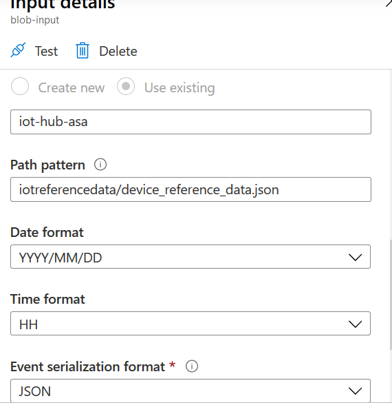
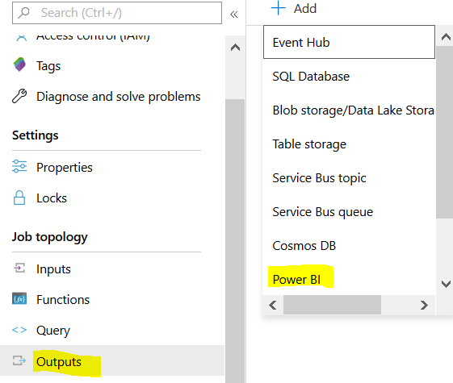

Big data and visualization

Hands-on lab step-by-step

November 2019

Information in this document, including URL and other Internet Web site references, is subject to change without notice. Unless otherwise noted, the example companies, organizations, products, domain names, e-mail addresses, logos, people, places, and events depicted herein are fictitious, and no association with any real company, organization, product, domain name, e-mail address, logo, person, place or event is intended or should be inferred. Complying with all applicable copyright laws is the responsibility of the user. Without limiting the rights under copyright, no part of this document may be reproduced, stored in or introduced into a retrieval system, or transmitted in any form or by any means (electronic, mechanical, photocopying, recording, or otherwise), or for any purpose, without the express written permission of Microsoft Corporation.

Microsoft may have patents, patent applications, trademarks, copyrights, or other intellectual property rights covering subject matter in this document. Except as expressly provided in any written license agreement from Microsoft, the furnishing of this document does not give you any license to these patents, trademarks, copyrights, or other intellectual property.

The names of manufacturers, products, or URLs are provided for informational purposes only and Microsoft makes no representations and warranties, either expressed, implied, or statutory, regarding these manufacturers or the use of the products with any Microsoft technologies. The inclusion of a manufacturer or product does not imply endorsement of Microsoft of the manufacturer or product. Links may be provided to third party sites. Such sites are not under the control of Microsoft and Microsoft is not responsible for the contents of any linked site or any link contained in a linked site, or any changes or updates to such sites. Microsoft is not responsible for webcasting or any other form of transmission received from any linked site. Microsoft is providing these links to you only as a convenience, and the inclusion of any link does not imply endorsement of Microsoft of the site or the products contained therein.

© 2019 Microsoft Corporation. All rights reserved.

Microsoft and the trademarks listed at https://www.microsoft.com/en-us/legal/intellectualproperty/Trademarks/Usage/General.aspx are trademarks of the Microsoft group of companies. All other trademarks are property of their respective owners.

**Contents**

<!-- TOC -->

- [Big data and visualization hands-on lab step-by-step](#big-data-and-visualization-hands-on-lab-step-by-step)
  - [Abstract and learning objectives](#abstract-and-learning-objectives)
  - [Overview](#overview)
  - [Requirements](#requirements)
  - [Exercise 1: Register a Device to IOT Hub](#exercise-1-register-device)
  - [Exercise 2: Environment for Data Ingestion into IOT Hub](#exercise-2-environment-setup)  
  - [Exercise 3: Upload the Reference data into Blob](#exercise-3-data-upload)
  - [Exercise 4: Configure Stream Analytics Job](#exercise-4-stream-analytics-setup)
  - [Exercise 5: Start Stream Analytics Job](#exercise-5-start-stream-analytics)
  - [Exercise 6: Run the Ingestion code to push data to IOT Hub](#exercise-7-run-ingestion-code)
  - [Exercise 7: Login to PowerBI Online account](#exercise-8-power-bi-online)

<!-- /TOC -->

# Big data and visualization hands-on lab step-by-step

## Abstract and learning objectives

This hands-on lab is designed to provide exposure to many of Microsoft's transformative line of business applications built using Microsoft big data and advanced analytics.

By the end of the lab, you will be able to show an end-to-end solution, leveraging many of these technologies, but not necessarily doing work in every component possible.

## Requirements

1. Microsoft Azure subscription must be pay-as-you-go or MSDN.

   - Trial subscriptions will not work.

3. Follow all the steps provided in [Before the Hands-on Lab](Before%20the%20HOL%20-%20Big%20data%20and%20visualization.md).

## Exercise 1: Register a Device to IOT Hub

1.	In the Azure Portal, type IOT Hub in Search box and Click on IOT Hub
2.	On the Left pane, Click on Shared Access Policies and click on iothubowner
    
 
    Copy the Primary Key and Store it in a Notepad, we will need this during Stream Analytics Input configuration
    
		 
3.	On the Left pane scroll down and Click on IOT Devices to create an identity for device to ingest the data into IOT Hub. Click +New
  
    
 

4.	Enter a Device ID and Click on Save
    

 
5.	Click on gensetdevice 
    
    

6.	Copy the Primary Connection String and Store it in a Notepad. This is needed to update the connection string in the code that will run on a device.
 
    
   

## Exercise 2: Environment for Data Ingestion into IOT Hub

Duration: 20 minutes

In this exercise, you will set up the environment needed to run the ingestion code into IOT Hub

1.	Ensure Python 3.7+ is installed
2.	Download Python code from Lab Files
3.	Genset data will be emailed during the lab
4.	Open the Python code in the a Python Editor or Notepad++ and update the connection string

    

5.	Update the input file location in iothub_client_telemetry_more_sample_run function 

    
  
6.	Ensure pandas, numpy, xlrd are installed. Else run the following commands

	pip install pandas
	pip install numpy
	pip install xlrd

7.	Install the Azure IOT SDK
	pip install azure-iot-device

## Exercise 3: Upload the Reference data into Blob

Duration: 10 minutes

In this exercise, you will upload the reference data into Blob. Download the device_reference_data from lab files to local.

1.	Go to the Storage Account and click on Container and Select iot-hub-asa
    

2.	Select the device_reference_data.json from your local and Click on Upload
3.	Click on Advanced and enter Upload to Folder as iotreferencedata. Click on Upload
 

## Exercise 4: Configure Stream Analytics Job

In this exercise, you will configure Stream Analytics - Input, Output and Query.

1.	Go to Stream Analytics resource that was created in Before HOL 

## Input Section
2.	Click on Inputs and then +Add Stream Input

    
 
3.	Enter the Input Alias name as iot-hub-input
4.	Click Select IoT Hub from your subscriptions. If it doesn’t populate automatically, select Provide IoT Hub settings manually
5.	Enter/Select IOT Hub as iothubworkshopdemo and other details as below. Click on Save

    

6.	Click on +Add reference input and Select Blob Storage
7.	Enter Input alias as blob-input
8.	Click on Select Blob storage from your subscriptions
9.	Select the right Storage Account, Container, path pattern where the reference data resides. Click on Save

    

## Output Section 

10.	On the Left Pane, Click on Outputs and Click on +Add -> PowerBI. This is for real time monitoring.

    

11.	Click on Authorize if there is already PowerBI Online account. Else Click on Sign Up using work account. Since the dashboard is already created using our account, we will provide the account details during the lab.
12.	Once Authorized, enter the Output Alias as power-bi-output
13.	Select My Workspace and enter dataset name as streamingData and table as streamingTable

    

14.	Add another output blob-raw-output, to store the raw input without any transformations in Blob for batch reporting or analytics

15.	On the Left Pane, Click on Outputs and Click on +Add -> Blob storage

    

16.	Enter Output alias as blob-raw-input
17.	Click on Select Blob storage from your subscriptions
18.	Select the right Storage Account, Container
19.	Give the path pattern as umw_iot_hub_raw_data_1/{datetime:yyyy}_{datetime:MM}_{datetime:dd}/{datetime:HH} where the data will get written. Click on Save.
20.	Similarly add one more output for storing a copy of aggregated data in Blob. Give the Output Alias as blob-agg-output and path pattern as umw_iot_hub_agg_data_1/{datetime:yyyy}_{datetime:MM}_{datetime:dd}/{datetime:HH} 

## Query Section
This is where the Business rules logic will be written and it is more of Query Language
21.	From the Left Pane, Click on Query
22.	Copy the Query from lab files – Stream Analytics Query and paste in the Query editor
23.	Click on Save Query

## Exercise 5: Start Stream Analytics Job

Duration: 10 minutes

In this exercise, you will trigger the Stream Analytics Job. 

1.	On the Left Pane in Stream Analytics, Overview -> Start -> Job output start time as Now. Click on Start. This will take some time to start the Streaming job

    

## Exercise 6: Run the Ingestion code to push data to IOT Hub

1.	On your local machine, execute the Python code either using PyCharm or execute the command manually. Go to the location where Python code resides and enter the command python iot-hub-umw-simulation-script.py.
2.	This will keep ingesting the data into IOT Hub for every 10 secs

## Exercise 7: Login to PowerBI account

Duration: 10 minutes 

1.	Go  https://app.powerbi.com and login using the account shared during the lab
2.	From My Workspace, Select iot-hub-dashboard3 from Dashboards section. Dashboard will get updated in real time

    

## After the hands-on lab

Duration: 10 minutes

In this exercise, attendees will deprovision any Azure resources that were created in support of the lab.

### Task 1: Delete resource group

1. Using the Azure portal, navigate to the Resource group you used throughout this hands-on lab by selecting **Resource groups** in the menu.

2. Search for the name of your research group and select it from the list.

3. Select **Delete** in the command bar and confirm the deletion by re-typing the Resource group name and selecting **Delete**.

You should follow all steps provided _after_ attending the Hands-on lab.
