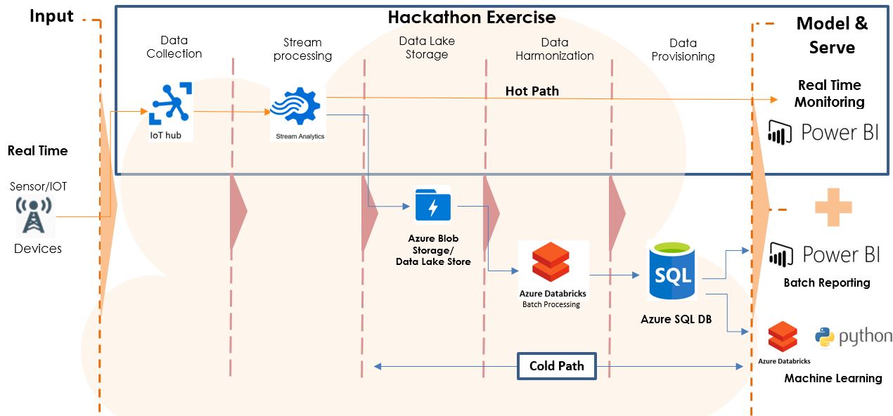

# Real Time Monitoring of IOT data

Use case -

Ingest the IOT data from IOT devices for real time monitoring.

We will be ingesting data from two different spreasheets shared which is available in lab-files. This data will be ingested by a Python code which will acts a Device emiting the data

Creating a data pipeline to ingest the data, process the data and visualize the streaming data

March 2020

## Target audience

- Data engineers
- Data architects

## Abstracts

### Workshop

At the end of this workshop, you will be better able to build a complete data pipeline and visualize the data.
In addition, you will learn how to ingest the data into Azure IOT hub, perform some processing in Azure Stream Analytics and visualize the data using Power BI.

### Hands-on lab

This hands-on lab is designed to provide exposure to many of Microsoft's transformative line of business applications built using Microsoft big data and advanced analytics.

By the end of the lab, you will be able to show an end-to-end solution, leveraging many of these technologies, but not necessarily doing work in every component possible.

## Azure services and related products

- Azure IOT Hub
- Azure Stream Analytics
- Azure Storage
- Power BI Desktop

